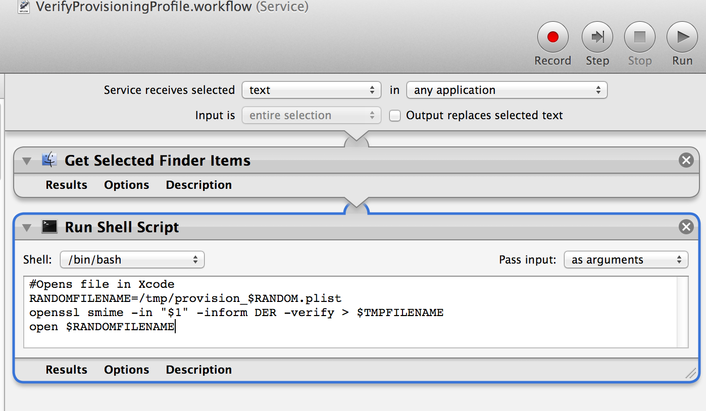

CodeSigningNotes
================

Notes on Code Signing (Certs, Keys, etc.)

XCode 5 Provisioning Profiles Location
--------------------------------------
`~/Library/MobileDevice/Provisioning Profiles`


Quick Look for Provisioning Profiles
-------------------------------------
https://github.com/chockenberry/Provisioning

Automator action for viewing Provisioning Profile information
-------------------------------------------------------------


Shell script
```
#Opens file in Xcode
RANDOMFILENAME=/tmp/provision_$RANDOM.plist
openssl smime -in "$1" -inform DER -verify > $RANDOMFILENAME
open $RANDOMFILENAME
```

source: [360idev-jay-graves-provisioning-profiles-like-a-pro](http://www.doubleencore.com/2013/09/360idev-jay-graves-provisioning-profiles-like-a-pro/)

PEM file
-------

The name comes from Privacy Enchanced Email. It can contain several certificates and even the private key.


[Privacy-enchanced Electronic Mail - Wikipedia Link](http://en.wikipedia.org/wiki/Privacy-enhanced_Electronic_Mail)


X.509
=====
[Wikipedia Link](http://en.wikipedia.org/wiki/X.509)


CSR - Certificate Signing Request
---------------------------------

Get text info about a CSR file

`openssl req -noout -text -in csr-file-name.csr`


p12 file
--------

Get information about a p12 file

`keytool -list -v -keystore mykeystore.p12 -storetype PKCS12 -storepass 123456`

`openssl pkcs12 -in <my pkcs12 file>.p12 -nodes -passin pass:<passphrase, or blank> |openssl x509 -noout -fingerprint
`

* Get private key from p12

`openssl pkcs12 -in yourP12File.p12 -nocerts -out privateKey.pem`

* Get certificate from p12

`openssl pkcs12 -in yourP12File.p12 -clcerts -nokeys -out publicCert.pem`

Using `keytool` to dump information about a p12 with CertAndKey

`keytool -list -v -storetype pkcs12 -keystore <keyStore.p12>`

HowTo...
========

* Import public/private keys into Mac OS X Keychain (don't just double click them!)

`security import priv_key.p12 -k ~/Library/Keychains/login.keychain`

`security import pub_key.pem -k ~/Library/Keychains/login.keychain`

* Verify a SHA-1 digest on OS X

`openssl sha1 <file>`

[Apple source](http://support.apple.com/kb/ht1652)

Resources
==============


* http://myonlineusb.wordpress.com/2011/06/19/what-are-the-differences-between-pem-der-p7bpkcs7-pfxpkcs12-certificates/
* [OpenSSL cheat sheet](https://twiki.cern.ch/twiki/bin/view/LinuxSupport/OpenSSLCheatsheet)

* Stackoverflow answer on 'What is a PEM file...'
[Stackoverflow answer](http://serverfault.com/a/9717)
* [OpenSSL tips and common commands](http://how2ssl.com/articles/openssl_commands_and_tips/)
* http://how2ssl.com/articles/working_with_pem_files/
